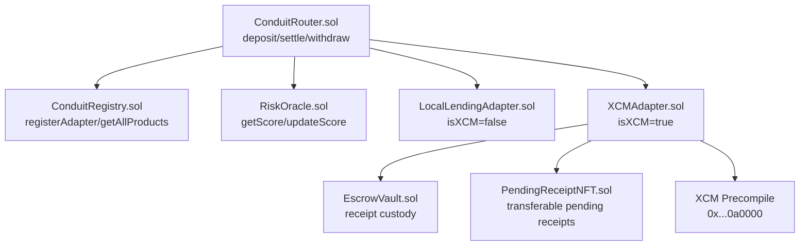

# 1Conduit

Deposit once. Yield from everywhere Polkadot reaches. Your in-flight position is tradeable while it settles.

## What It Does

1Conduit is a yield aggregator native to Polkadot Hub. Users and AI agents can discover yield-bearing positions across local Hub lending protocols and XCM-connected parachains, and invest through a single router contract in one transaction.

In-flight XCM positions are represented as transferable ERC-721 receipt NFTs. Whoever holds the NFT at settlement time receives the yield. This turns the async nature of XCM into a useful product primitive instead of an implementation detail.

## Why Polkadot - Three PVM Categories

| PVM Category | Implementation | Honest Claim |
|---|---|---|
| **PVM-experiments** | `RiskOracle.sol` compiled via Revive to RISC-V PVM. Every contract in 1Conduit runs on PolkaVM's RISC-V execution environment. | Solidity contracts compiled to native RISC-V via Revive run more efficiently than EVM bytecode interpretation. The entire stack - registry, router, adapters, XCM dispatch - is PVM-native. |
| **Native Assets** | MockDOT as the XCM path input on testnet; architecture routes native DOT on mainnet without wrapping or bridging. | DOT is Polkadot's native asset. The XCM path uses it directly. No bridge, no wrapper. |
| **Polkadot Native Functionality** | `XCMAdapter.sol` calls the XCM precompile at `0x00000000000000000000000000000000000a0000` from Solidity. Two-phase settlement with PendingReceipt NFT is designed around XCM's honest async model. | XCM is asynchronous by design. 1Conduit does not fake synchronous cross-chain execution - it makes the async nature a product feature. This is not possible on Ethereum. |

This architecture is not possible on Ethereum - there is no native async cross-consensus messaging, no XCM precompile, and no protocol-native relay asset equivalent to DOT.

## Architecture



## Deployed Contracts (Paseo Asset Hub)

**Network:** Paseo Asset Hub (Chain ID: `420420417`)  
**Explorer:** https://blockscout-testnet.polkadot.io

| Contract | Address | Status |
|---|---|---|
| ConduitRegistry (v1) | [0xa5E8c0Bf7b2caf0F9A779D1B32640DC88AC258A2](https://blockscout-testnet.polkadot.io/address/0xa5E8c0Bf7b2caf0F9A779D1B32640DC88AC258A2) | Deprecated |
| ConduitRegistry (v2) | [0x2B29eDEdfbe33581673755d217Da600f92eA7CC6](https://blockscout-testnet.polkadot.io/address/0x2B29eDEdfbe33581673755d217Da600f92eA7CC6) | Active |
| MockERC20 (mUSDC) | [0x5FAfa9c09BC5d6b79fF0e3dBC0AaaB651eEB894C](https://blockscout-testnet.polkadot.io/address/0x5FAfa9c09BC5d6b79fF0e3dBC0AaaB651eEB894C) | Active |
| MockYieldToken (cYLD) | [0x256Ca433e024Ed7baB26a1fE6aC0658636C2749B](https://blockscout-testnet.polkadot.io/address/0x256Ca433e024Ed7baB26a1fE6aC0658636C2749B) | Active |
| MockLendingPool | [0x430819D80517A1Dbe98b47cF70FC951163Ceed5b](https://blockscout-testnet.polkadot.io/address/0x430819D80517A1Dbe98b47cF70FC951163Ceed5b) | Active |
| LocalLendingAdapter | [0x5b50eaE5Fd7b3e09687938FA9D69ccc6a9200746](https://blockscout-testnet.polkadot.io/address/0x5b50eaE5Fd7b3e09687938FA9D69ccc6a9200746) | Active |
| RiskOracle (ink! v6, broken v1) | [0xDfB3c383642960D1488aBcf7107f053455A96f82](https://blockscout-testnet.polkadot.io/address/0xDfB3c383642960D1488aBcf7107f053455A96f82) | Deprecated |
| RiskOracle (ink! v6, deprecated) | [0x6Bee0885A5d7c621215AD773a8c692a1bD16Aa60](https://blockscout-testnet.polkadot.io/address/0x6Bee0885A5d7c621215AD773a8c692a1bD16Aa60) | Deprecated |
| RiskOracle.sol | [0x925287C7F2BC699A7874FE66Aacc95da432094B3](https://blockscout-testnet.polkadot.io/address/0x925287C7F2BC699A7874FE66Aacc95da432094B3) | Active |
| EscrowVault (v1) | [0xe68C52f6bd8985e321d1C81491608EA0af63C577](https://blockscout-testnet.polkadot.io/address/0xe68C52f6bd8985e321d1C81491608EA0af63C577) | Deprecated |
| EscrowVault (v2) | [0x19EA950c5468D8b2Da584F777124AC3a017d0cA5](https://blockscout-testnet.polkadot.io/address/0x19EA950c5468D8b2Da584F777124AC3a017d0cA5) | Active |
| PendingReceiptNFT (v1) | [0x31D4BbD8FFB9c77B90F5b679D19C998ACdDC14AF](https://blockscout-testnet.polkadot.io/address/0x31D4BbD8FFB9c77B90F5b679D19C998ACdDC14AF) | Deprecated |
| PendingReceiptNFT (v2) | [0x2B6b31eF4e39565BDd1a914fA70B8451812F7210](https://blockscout-testnet.polkadot.io/address/0x2B6b31eF4e39565BDd1a914fA70B8451812F7210) | Active |
| XCMAdapter (v2) | [0xF605c8B148A6Af6B6ABC049074fBFaa653219F46](https://blockscout-testnet.polkadot.io/address/0xF605c8B148A6Af6B6ABC049074fBFaa653219F46) | Active |
| ConduitRouter (v2) | [0xc72Eb468E1e406D02A4Cb47aA3BDB69b9F4B6538](https://blockscout-testnet.polkadot.io/address/0xc72Eb468E1e406D02A4Cb47aA3BDB69b9F4B6538) | Deprecated |
| ConduitRouter (v3) | [0x212349691746d378DC814AF70674474843F695BD](https://blockscout-testnet.polkadot.io/address/0x212349691746d378DC814AF70674474843F695BD) | Active |
| MockDOT | [0x629FA1da2eafa71456F72e0A8dA208D25A9D6bd2](https://blockscout-testnet.polkadot.io/address/0x629FA1da2eafa71456F72e0A8dA208D25A9D6bd2) | Active |

**Relayer address:** `0x6Bee0885A5d7c621215AD773a8c692a1bD16Aa60`  
Full deployment history and transaction references live in `contracts/DEPLOYED_ADDRESSES.md`.

## Architecture Notes

The original RiskOracle was implemented in Rust using ink! v6. During development,
ink! v6 proved unreliable on Paseo Passet Hub following its discontinuation in
January 2026. The community successor (wrevive) launched March 3, 2026 and is
explicitly not production-ready. Rather than introduce an unstable dependency at
submission time, we ported RiskOracle to Solidity - the scoring formula is unchanged.

The PVM-experiments story is carried by the full stack: every contract in 1Conduit -
registry, router, adapters, and XCM dispatch - runs on PolkaVM's RISC-V execution
environment. The sharpest Polkadot-native demonstration remains the XCM precompile
call in Module 6: a Solidity contract dispatching cross-chain messages in a single
transaction. This primitive does not exist on Ethereum.

**v2 migration path:** RevX (Parity's new Rust IDE, launched February 2026) is the
intended path for reintroducing a Rust RiskOracle once it stabilises.

## Getting Started

### Prerequisites

- Node.js 18+
- pnpm
- Foundry (foundry-polkadot fork - see docs/SETUP.md)
- An account funded with PAS on Paseo Asset Hub

### Running the Frontend

```bash
cd frontend
pnpm install
pnpm dev
# Open http://localhost:3000
# Connect MetaMask or Talisman to Paseo Asset Hub (Chain ID: 420420417)
```

### Running Foundry Tests

```bash
cd contracts
forge test
# Expected: all tests pass, zero failures
```

### Running the Relayer

```bash
cd scripts
npm install
cp .env.example .env
# Fill in RELAYER_PRIVATE_KEY and contract addresses
npx tsx relayer.ts settle <receiptId>
```

## What's Next

- **Trustless settlement** - replace permissioned relayer with XCM response handling or light-client proof verification
- **Multiple XCM destinations** - Acala, HydraDX, and other parachains via the adapter registry pattern
- **Rust RiskOracle via RevX** - reintroduce the Rust scoring component once RevX (Parity's new Rust IDE, launched February 2026) stabilises
